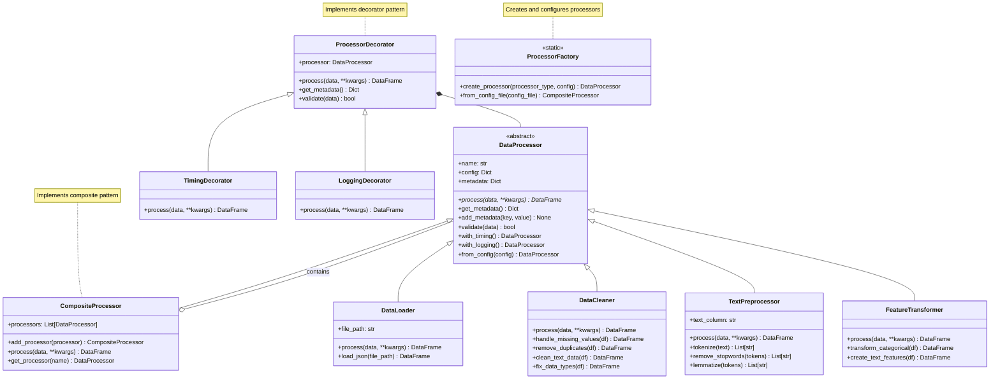

# BiztelAI Data Pipeline - Class Diagram

## Design Patterns Used

1. **Abstract Factory Pattern** - `ProcessorFactory` creates different types of processors
2. **Composite Pattern** - `CompositeProcessor` allows treating individual processors and compositions of processors uniformly
3. **Decorator Pattern** - `ProcessorDecorator` and its subclasses add functionality to processors without modifying their code
4. **Template Method Pattern** - `DataProcessor` defines the skeleton of the processing algorithm, deferring specific steps to subclasses

## Pipeline Configuration

The pipeline is configured using a JSON configuration file that specifies:
- Pipeline metadata (name, description, version)
- Input and output files
- Logging configuration
- Processor chain with processor-specific configurations
- Caching and parallelism options

## Runtime Flow

1. `run_pipeline.py` parses command-line arguments and loads configuration
2. `ProcessorFactory` creates a pipeline from the configuration
3. Pipeline processes the data through each processor in sequence
4. Each processor applies its specific transformation to the data
5. Decorators add timing and logging functionality around processor execution
6. Results are written to the specified output file

## Benefits of the Architecture

1. **Modularity**: Each processor handles a specific aspect of data processing
2. **Extensibility**: New processors can be easily added by subclassing `DataProcessor`
3. **Configurability**: Pipeline behavior can be modified through configuration without code changes
4. **Observability**: Timing and logging decorators provide insights into processing performance
5. **Reusability**: Processors can be reused in different pipelines and configurations 